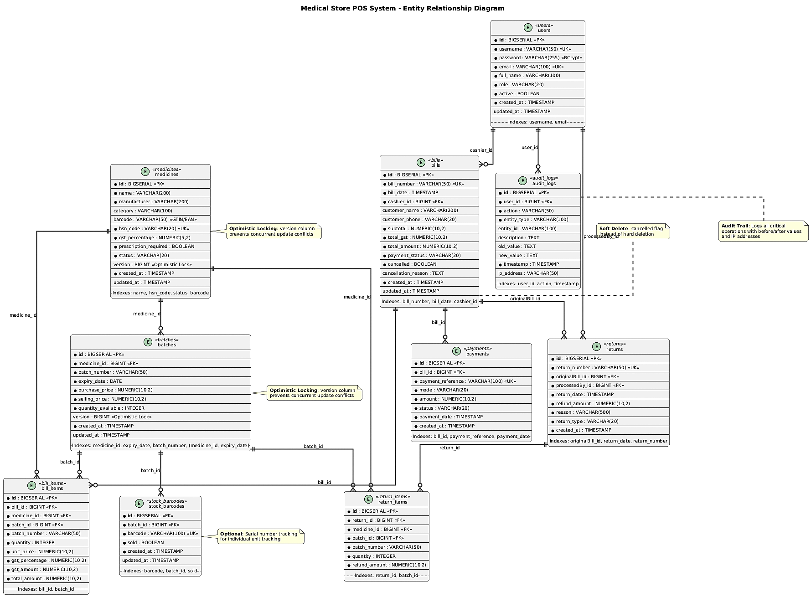

# Medical Store POS System

## 🎥 Project Demo Video

[](https://youtu.be/pzBrswZ8kcM)

---


## 📋 Table of Contents
- [Overview](#overview)
- [Technology Stack](#technology-stack)
- [System Architecture](#system-architecture)
- [Database Schema](#database-schema)
- [API Endpoints](#api-endpoints)
- [Frontend Modules](#frontend-modules)
- [Role-Based Access Control](#role-based-access-control)
- [Setup Instructions](#setup-instructions)
- [Deployment](#deployment)
- [Development](#development)

---

## 🎯 Overview

A production-grade Point of Sale (POS) system designed specifically for medical stores and pharmacies. The system provides comprehensive functionality for billing, inventory management, medicine tracking, returns processing, and detailed reporting with GST compliance.

### Key Features
- **Billing & POS**: Real-time bill generation with GST calculation and PDF export
- **Inventory Management**: Batch tracking with expiry date monitoring and low stock alerts
- **Medicine Management**: Complete medicine catalog with barcode support (GTIN/EAN)
- **Returns Processing**: Customer return and refund management with audit trail
- **Reporting**: Sales reports, GST reports, and cashier performance analytics
- **Audit Logging**: Complete audit trail of all system activities with IP tracking
- **User Management**: Role-based access control with multiple user roles
- **PDF Generation**: Automatic bill PDF generation using iText 7
- **Barcode Scanning**: Support for barcode scanning in frontend using ZXing library
- **Login History**: Track user login/logout events
- **User Activity**: Monitor all user actions across the system

---

## 🛠 Technology Stack

### Backend
- **Framework**: Spring Boot 3.2.0
- **Language**: Java 17
- **Database**: PostgreSQL
- **ORM**: Spring Data JPA / Hibernate
- **Security**: Spring Security with JWT (io.jsonwebtoken 0.12.3)
- **API Documentation**: Swagger/OpenAPI 3 (springdoc-openapi 2.3.0)
- **PDF Generation**: iText 7 (8.0.2)
- **Build Tool**: Maven 3.9+
- **Utilities**: Lombok, MapStruct 1.5.5
- **Validation**: Jakarta Validation

### Frontend
- **Framework**: Angular 17
- **Language**: TypeScript 5.2
- **UI Library**: Bootstrap 5.3
- **Barcode Scanner**: ZXing Library 0.21.3
- **Build Tool**: Angular CLI 17
- **State Management**: RxJS 7.8

### Database
- **RDBMS**: PostgreSQL 12+
- **Connection Pool**: HikariCP
- **Migration**: SQL scripts in `DBQ/` directory

### Deployment Platforms
- Docker
- Railway (railway.json)
- Render (render.yaml)
- Vercel (vercel.json)
- Heroku (Procfile)

---

## 🏗 System Architecture

### Architecture Overview


### Request Flow

1. **Client Request** → Angular frontend makes HTTP request via API service
2. **JWT Authentication** → JwtAuthenticationFilter validates JWT token
3. **Role Authorization** → SecurityConfig checks user permissions via @PreAuthorize
4. **Controller** → REST controller receives request (@RestController)
5. **Service Layer** → Business logic processing with transaction management
6. **Repository** → Data access via Spring Data JPA
7. **Database** → PostgreSQL executes query with connection pooling
8. **Audit Logging** → AuditService logs critical operations
9. **Response** → JSON response sent back to client

---

## 🗄 Database Schema

### Entity Relationship Diagram



### Table Descriptions

#### 1. **users**
Stores all system users with authentication and authorization information.
- **Primary Key**: `id`
- **Unique Constraints**: `username`, `email`
- **Indexes**: `username`, `email`
- **Relationships**: Referenced by `bills.cashier_id`, `returns.processedBy_id`, `audit_logs.user_id`
- **Security**: Passwords stored as BCrypt hashes

#### 2. **medicines**
Master catalog of all medicines/products in the system.
- **Primary Key**: `id`
- **Unique Constraints**: `hsn_code`
- **Indexes**: `name`, `hsn_code`, `status`, `barcode`
- **Special Features**: Optimistic locking via `version` column
- **Relationships**: One-to-Many with `batches`

#### 3. **batches**
Tracks inventory batches with expiry dates and pricing.
- **Primary Key**: `id`
- **Foreign Keys**: `medicine_id` → `medicines.id`
- **Indexes**: `medicine_id`, `expiry_date`, `batch_number`, composite `(medicine_id, expiry_date)`
- **Special Features**: Optimistic locking via `version` column
- **Relationships**: Many-to-One with `medicines`, One-to-Many with `bill_items`, `return_items`, `stock_barcodes`

#### 4. **stock_barcodes**
Optional table for serial number/individual unit tracking.
- **Primary Key**: `id`
- **Foreign Keys**: `batch_id` → `batches.id`
- **Unique Constraints**: `barcode`
- **Indexes**: `barcode`, `batch_id`, `sold`
- **Relationships**: Many-to-One with `batches`

#### 5. **bills**
Main billing/transaction table.
- **Primary Key**: `id`
- **Unique Constraints**: `bill_number`
- **Foreign Keys**: `cashier_id` → `users.id`
- **Indexes**: `bill_number`, `bill_date`, `cashier_id`
- **Relationships**: One-to-Many with `bill_items`, `payments`, `returns`

#### 6. **bill_items**
Line items for each bill.
- **Primary Key**: `id`
- **Foreign Keys**: 
  - `bill_id` → `bills.id`
  - `medicine_id` → `medicines.id`
  - `batch_id` → `batches.id`
- **Indexes**: `bill_id`, `batch_id`
- **Relationships**: Many-to-One with `bills`, `medicines`, `batches`

#### 7. **payments**
Payment records for bills.
- **Primary Key**: `id`
- **Foreign Keys**: `bill_id` → `bills.id`
- **Unique Constraints**: `payment_reference`
- **Indexes**: `bill_id`, `payment_reference`, `payment_date`
- **Relationships**: Many-to-One with `bills`

#### 8. **returns**
Customer return transactions.
- **Primary Key**: `id`
- **Unique Constraints**: `return_number`
- **Foreign Keys**: 
  - `originalBill_id` → `bills.id`
  - `processedBy_id` → `users.id`
- **Indexes**: `originalBill_id`, `return_date`, `return_number`
- **Relationships**: One-to-Many with `return_items`

#### 9. **return_items**
Line items for returns.
- **Primary Key**: `id`
- **Foreign Keys**: 
  - `return_id` → `returns.id`
  - `medicine_id` → `medicines.id`
  - `batch_id` → `batches.id`
- **Indexes**: `return_id`, `batch_id`
- **Relationships**: Many-to-One with `returns`, `medicines`, `batches`

#### 10. **audit_logs**
System-wide audit trail.
- **Primary Key**: `id`
- **Foreign Keys**: `user_id` → `users.id`
- **Indexes**: `user_id`, `action`, `timestamp`
- **Relationships**: Many-to-One with `users`

### Key Design Decisions

1. **Optimistic Locking**: `medicines` and `batches` tables use `version` column to prevent concurrent update conflicts
2. **Barcode Strategy**: 
   - `medicines.barcode`: GTIN/EAN (product identifier, not unique per unit)
   - `stock_barcodes.barcode`: Serial numbers (unique per unit, optional)
3. **Soft Deletes**: Bills support cancellation via `cancelled` flag instead of hard deletion
4. **Audit Trail**: All critical operations are logged in `audit_logs` with before/after values and IP addresses
5. **Indexing Strategy**: Comprehensive indexes on foreign keys, search fields, and date columns for performance
6. **Connection Pooling**: HikariCP configured for optimal database connection management

---

## 🔌 API Documentation

### Base URL
```
http://localhost:8080/api
```

### Authentication

All API endpoints (except `/auth/login`) require JWT authentication. Include the token in the Authorization header:

```
Authorization: Bearer <your-jwt-token>
```

### API Documentation Tools
- **Swagger UI**: `http://localhost:8080/swagger-ui.html`
- **OpenAPI JSON**: `http://localhost:8080/v3/api-docs`

---

### Authentication Endpoints

#### POST `/auth/login`
User login and JWT token generation.

**Request Body:**
```json
{
  "username": "cashier",
  "password": "password123"
}
```

**Response (200 OK):**
```json
{
  "token": "eyJhbGciOiJIUzI1NiIsInR5cCI6IkpXVCJ9...",
  "type": "Bearer",
  "userId": 2,
  "username": "cashier",
  "fullName": "Cashier User",
  "email": "cashier@medicalstore.com",
  "role": "CASHIER"
}
```

**cURL Example:**
```bash
curl -X POST http://localhost:8080/api/auth/login \
  -H "Content-Type: application/json" \
  -d '{"username":"cashier","password":"password123"}'
```

**Error Responses:**
- `401 Unauthorized`: Invalid credentials
- `400 Bad Request`: Missing or invalid request body

---

#### POST `/auth/logout`
User logout (logs the event).

**Headers:**
```
Authorization: Bearer <token>
```

**Response (200 OK):** Empty body

---

### Billing Endpoints

#### POST `/cashier/bills`
Create a new bill with items and payments.

**Headers:**
```
Authorization: Bearer <token>
Content-Type: application/json
```

**Request Body:**
```json
{
  "customerName": "John Doe",
  "customerPhone": "9876543210",
  "items": [
    {
      "medicineId": 1,
      "quantity": 2
    },
    {
      "barcode": "8901234567890",
      "quantity": 1
    }
  ],
  "payments": [
    {
      "mode": "CASH",
      "amount": 500.00,
      "paymentReference": "CASH-001"
    }
  ]
}
```

**Response (201 Created):**
```json
{
  "id": 1,
  "billNumber": "BILL-2024-001",
  "billDate": "2024-01-15T10:30:00",
  "cashierId": 2,
  "cashierName": "Cashier User",
  "customerName": "John Doe",
  "customerPhone": "9876543210",
  "subtotal": 450.00,
  "totalGst": 81.00,
  "totalAmount": 531.00,
  "paymentStatus": "PAID",
  "cancelled": false,
  "items": [
    {
      "id": 1,
      "medicineId": 1,
      "medicineName": "Paracetamol 500mg",
      "batchNumber": "BATCH-001",
      "quantity": 2,
      "unitPrice": 150.00,
      "gstPercentage": 18.00,
      "gstAmount": 54.00,
      "totalAmount": 354.00
    }
  ],
  "payments": [
    {
      "id": 1,
      "paymentReference": "CASH-001",
      "mode": "CASH",
      "amount": 531.00,
      "status": "COMPLETED",
      "paymentDate": "2024-01-15T10:30:00"
    }
  ],
  "createdAt": "2024-01-15T10:30:00"
}
```

**cURL Example:**
```bash
curl -X POST http://localhost:8080/api/cashier/bills \
  -H "Authorization: Bearer <token>" \
  -H "Content-Type: application/json" \
  -d '{
    "customerName": "John Doe",
    "items": [{"medicineId": 1, "quantity": 2}],
    "payments": [{"mode": "CASH", "amount": 500.00}]
  }'
```

---

#### GET `/cashier/bills/{id}`
Get bill details by ID.

**Response (200 OK):** Same as POST response structure

---

#### GET `/cashier/bills/number/{billNumber}`
Get bill details by bill number.

**Example:**
```
GET /api/cashier/bills/number/BILL-2024-001
```

---

#### GET `/cashier/bills`
Get all bills (purchase history).

**Response (200 OK):**
```json
[
  {
    "id": 1,
    "billNumber": "BILL-2024-001",
    "billDate": "2024-01-15T10:30:00",
    "totalAmount": 531.00,
    "paymentStatus": "PAID",
    ...
  }
]
```

---

#### POST `/cashier/bills/{id}/cancel`
Cancel a bill.

**Query Parameters:**
- `reason` (required): Cancellation reason

**Example:**
```
POST /api/cashier/bills/1/cancel?reason=Customer%20requested%20cancellation
```

**Response (200 OK):** Updated bill with `cancelled: true`

---

#### GET `/cashier/bills/{id}/pdf`
Download bill as PDF.

**Response:** PDF file (application/pdf)

**cURL Example:**
```bash
curl -X GET http://localhost:8080/api/cashier/bills/1/pdf \
  -H "Authorization: Bearer <token>" \
  -o bill.pdf
```

---

### Medicine Management Endpoints

#### POST `/pharmacist/medicines`
Create a new medicine.

**Request Body:**
```json
{
  "name": "Paracetamol 500mg",
  "manufacturer": "ABC Pharmaceuticals",
  "category": "Pain Relief",
  "barcode": "8901234567890",
  "hsnCode": "30049099",
  "gstPercentage": 18.00,
  "prescriptionRequired": false,
  "initialStock": 100,
  "purchasePrice": 50.00,
  "sellingPrice": 75.00,
  "batchNumber": "BATCH-001",
  "expiryDate": "2025-12-31"
}
```

**Response (201 Created):**
```json
{
  "id": 1,
  "name": "Paracetamol 500mg",
  "manufacturer": "ABC Pharmaceuticals",
  "category": "Pain Relief",
  "barcode": "8901234567890",
  "hsnCode": "30049099",
  "gstPercentage": 18.00,
  "prescriptionRequired": false,
  "status": "ACTIVE",
  "totalStock": 100,
  "availableStock": 100,
  "lowStock": false,
  "outOfStock": false,
  "createdAt": "2024-01-15T10:00:00"
}
```

---

#### GET `/pharmacist/medicines`
Get all medicines.

**Response (200 OK):** Array of medicine objects

---

#### GET `/pharmacist/medicines/{id}`
Get medicine by ID.

**Response (200 OK):** Single medicine object

---

#### GET `/pharmacist/medicines/search?name={name}`
Search medicines by name (partial match).

**Example:**
```
GET /api/pharmacist/medicines/search?name=paracetamol
```

**Response (200 OK):** Array of matching medicines

---

#### GET `/pharmacist/medicines/barcode/{barcode}`
Get medicine by barcode.

**Example:**
```
GET /api/pharmacist/medicines/barcode/8901234567890
```

---

#### PUT `/pharmacist/medicines/{id}`
Update medicine details.

**Request Body:** Same structure as POST (all fields optional)

**Response (200 OK):** Updated medicine object

---

#### PATCH `/pharmacist/medicines/{id}/status?status={status}`
Update medicine status.

**Status Values:** `ACTIVE`, `DISCONTINUED`

**Example:**
```
PATCH /api/pharmacist/medicines/1/status?status=DISCONTINUED
```

---

### Batch Management Endpoints

#### POST `/pharmacist/batches`
Create a new batch for a medicine.

**Request Body:**
```json
{
  "medicineId": 1,
  "batchNumber": "BATCH-2024-001",
  "expiryDate": "2025-12-31",
  "purchasePrice": 50.00,
  "sellingPrice": 75.00,
  "quantityAvailable": 100,
  "barcodes": ["BC001", "BC002", "BC003"]
}
```

**Response (201 Created):**
```json
{
  "id": 1,
  "medicineId": 1,
  "medicineName": "Paracetamol 500mg",
  "batchNumber": "BATCH-2024-001",
  "expiryDate": "2025-12-31",
  "purchasePrice": 50.00,
  "sellingPrice": 75.00,
  "quantityAvailable": 100,
  "isExpired": false,
  "createdAt": "2024-01-15T10:00:00"
}
```

---

#### GET `/pharmacist/batches/medicine/{medicineId}`
Get all batches for a specific medicine.

**Response (200 OK):** Array of batch objects

---

#### GET `/pharmacist/batches/expired`
Get all expired batches.

**Response (200 OK):** Array of expired batch objects

---

#### GET `/pharmacist/batches/low-stock?threshold={threshold}`
Get batches with low stock.

**Query Parameters:**
- `threshold` (optional, default: 10): Minimum stock threshold

**Example:**
```
GET /api/pharmacist/batches/low-stock?threshold=20
```

---

#### PUT `/pharmacist/batches/{id}`
Update batch details.

**Request Body:** Same structure as POST (all fields optional)

---

#### PATCH `/pharmacist/batches/{id}/stock`
Update stock quantity.

**Request Body:**
```json
{
  "quantityAvailable": 50
}
```

---

### Returns Endpoints

#### POST `/cashier/returns`
Process a customer return.

**Request Body:**
```json
{
  "billId": 1,
  "reason": "Product damaged",
  "items": [
    {
      "billItemId": 1,
      "quantity": 1
    }
  ]
}
```

**Response (201 Created):**
```json
{
  "id": 1,
  "returnNumber": "RET-2024-001",
  "originalBillId": 1,
  "originalBillNumber": "BILL-2024-001",
  "processedById": 3,
  "processedByName": "Customer Support",
  "returnDate": "2024-01-16T14:00:00",
  "refundAmount": 177.00,
  "reason": "Product damaged",
  "returnType": "PARTIAL",
  "items": [
    {
      "id": 1,
      "medicineId": 1,
      "medicineName": "Paracetamol 500mg",
      "batchNumber": "BATCH-001",
      "quantity": 1,
      "refundAmount": 177.00
    }
  ],
  "createdAt": "2024-01-16T14:00:00"
}
```

---

### Reports Endpoints

#### GET `/admin/reports/sales`
Get sales report for a date range.

**Query Parameters:**
- `startDate` (required): Start date (ISO format: `YYYY-MM-DD`)
- `endDate` (required): End date (ISO format: `YYYY-MM-DD`)

**Example:**
```
GET /api/admin/reports/sales?startDate=2024-01-01&endDate=2024-01-31
```

**Response (200 OK):**
```json
{
  "startDate": "2024-01-01",
  "endDate": "2024-01-31",
  "totalSales": 50000.00,
  "totalBills": 150,
  "averageBillAmount": 333.33,
  "items": [
    {
      "date": "2024-01-15",
      "totalSales": 5000.00,
      "billCount": 20
    }
  ]
}
```

---

#### GET `/admin/reports/gst`
Get GST report for a date range.

**Query Parameters:**
- `startDate` (required): Start date
- `endDate` (required): End date

**Response (200 OK):**
```json
{
  "startDate": "2024-01-01",
  "endDate": "2024-01-31",
  "totalGst": 9000.00,
  "gstByRate": [
    {
      "gstRate": 18.00,
      "totalGst": 9000.00,
      "totalSales": 50000.00
    }
  ]
}
```

---

#### GET `/admin/reports/cashier/{cashierId}`
Get cashier performance report.

**Query Parameters:**
- `startDate` (required): Start date
- `endDate` (required): End date

**Response (200 OK):**
```json
{
  "cashierId": 2,
  "cashierName": "Cashier User",
  "startDate": "2024-01-01",
  "endDate": "2024-01-31",
  "totalBills": 50,
  "totalSales": 25000.00,
  "averageBillAmount": 500.00
}
```

---

#### GET `/admin/reports/stock`
Get stock report.

**Response (200 OK):**
```json
{
  "totalMedicines": 100,
  "totalBatches": 250,
  "expiredBatches": [
    {
      "id": 1,
      "medicineName": "Medicine A",
      "batchNumber": "BATCH-001",
      "expiryDate": "2023-12-31",
      "quantityAvailable": 10
    }
  ],
  "lowStockBatches": [
    {
      "id": 2,
      "medicineName": "Medicine B",
      "batchNumber": "BATCH-002",
      "quantityAvailable": 5
    }
  ]
}
```

---

### User Management Endpoints

#### GET `/admin/users`
Get all users.

**Response (200 OK):**
```json
[
  {
    "id": 1,
    "username": "admin",
    "email": "admin@medicalstore.com",
    "fullName": "Administrator",
    "role": "ADMIN",
    "active": true,
    "createdAt": "2024-01-01T00:00:00"
  }
]
```

---

#### GET `/admin/users/{id}`
Get user by ID.

**Response (200 OK):** Single user object

---

#### PUT `/admin/users/{id}/password`
Change user password.

**Request Body:**
```json
{
  "newPassword": "newSecurePassword123"
}
```

**Response (200 OK):** Updated user object

---

#### PUT `/admin/users/{id}/status`
Update user status (activate/deactivate).

**Query Parameters:**
- `active` (required): `true` or `false`

**Example:**
```
PUT /api/admin/users/2/status?active=false
```

**Response (200 OK):** Updated user object

---

### Audit Logs Endpoints

#### GET `/admin/audit-logs`
Get all audit logs.

**Response (200 OK):**
```json
[
  {
    "id": 1,
    "userId": 2,
    "userName": "cashier",
    "action": "CREATE",
    "entityType": "Bill",
    "entityId": "1",
    "description": "Created new bill",
    "oldValue": null,
    "newValue": "{\"billNumber\":\"BILL-2024-001\"}",
    "timestamp": "2024-01-15T10:30:00",
    "ipAddress": "192.168.1.100"
  }
]
```

---

#### GET `/admin/audit-logs/user/{userId}`
Get audit logs for a specific user.

**Response (200 OK):** Array of audit log objects

---

## 📝 Common Request/Response Formats

### Payment Modes
- `CASH`
- `CARD`
- `UPI`
- `NET_BANKING`
- `WALLET`

### Payment Status
- `PENDING`
- `COMPLETED`
- `FAILED`
- `REFUNDED`

### Bill Payment Status
- `PENDING`
- `PAID`
- `PARTIALLY_PAID`
- `CANCELLED`

### Medicine Status
- `ACTIVE`
- `DISCONTINUED`

### User Roles
- `ADMIN`
- `CASHIER`
- `STOCK_MONITOR`
- `STOCK_KEEPER`
- `CUSTOMER_SUPPORT`
- `ANALYST`
- `MANAGER`

---

## ⚠️ Error Responses

All error responses follow this format:

```json
{
  "timestamp": "2024-01-15T10:30:00",
  "status": 400,
  "error": "Bad Request",
  "message": "Validation failed",
  "path": "/api/cashier/bills"
}
```

### Common HTTP Status Codes

| Status Code | Description |
|------------|-------------|
| `200 OK` | Request successful |
| `201 Created` | Resource created successfully |
| `400 Bad Request` | Invalid request data |
| `401 Unauthorized` | Missing or invalid JWT token |
| `403 Forbidden` | Insufficient permissions |
| `404 Not Found` | Resource not found |
| `409 Conflict` | Optimistic locking conflict |
| `500 Internal Server Error` | Server error |

---

## 🔐 Authentication Flow

1. **Login** → POST `/auth/login` with credentials
2. **Receive Token** → Extract `token` from response
3. **Include in Requests** → Add header: `Authorization: Bearer <token>`
4. **Token Expiration** → Token expires after 24 hours, re-login required

---

## 📚 Additional Resources

- **Interactive API Documentation**: Visit `http://localhost:8080/swagger-ui.html` for interactive API testing
- **OpenAPI Specification**: Download from `http://localhost:8080/v3/api-docs`
- **Postman Collection**: Import OpenAPI spec into Postman for API testing

---

## 🎨 Frontend Modules

### Module Structure

```
frontend/
├── src/
│   ├── app/
│   │   ├── auth/                    # Authentication module
│   │   │   ├── login/               # Login component
│   │   │   ├── unauthorized/       # Unauthorized access component
│   │   │   ├── auth.guard.ts        # Authentication guard
│   │   │   ├── role.guard.ts        # Role-based access guard
│   │   │   ├── token.interceptor.ts # JWT token interceptor
│   │   │   └── auth.service.ts      # Authentication service
│   │   │
│   │   ├── core/                    # Core shared components
│   │   │   ├── components/          # Reusable components
│   │   │   │   ├── app-shell/       # Main app shell
│   │   │   │   ├── dialog/          # Dialog component
│   │   │   │   └── svg-icon/        # SVG icon component
│   │   │   ├── constants/           # API endpoints
│   │   │   ├── models/              # TypeScript models
│   │   │   ├── pipes/               # Custom pipes
│   │   │   └── services/            # Core services
│   │   │       ├── api.service.ts   # Base API service
│   │   │       ├── auth.service.ts  # Auth service
│   │   │       ├── billing.service.ts
│   │   │       ├── inventory.service.ts
│   │   │       ├── report.service.ts
│   │   │       ├── return.service.ts
│   │   │       ├── user.service.ts
│   │   │       └── audit-log.service.ts
│   │   │
│   │   └── modules/                 # Feature modules
│   │       ├── billing/             # Billing/POS module
│   │       ├── inventory/           # Inventory monitoring
│   │       ├── medicines/           # Medicine management
│   │       ├── returns/             # Returns processing
│   │       ├── reports/             # Reports & analytics
│   │       ├── purchase-history/    # Purchase history
│   │       ├── user-activity/       # User activity logs
│   │       ├── login-history/       # Login history
│   │       └── user-management/     # User management
```

### Route Configuration

| Route | Module | Accessible Roles |
|-------|--------|------------------|
| `/auth/login` | Authentication | Public |
| `/billing` | Billing | CASHIER, ADMIN |
| `/inventory` | Inventory | STOCK_MONITOR, ADMIN |
| `/medicines` | Medicines | STOCK_KEEPER, ADMIN |
| `/returns` | Returns | CUSTOMER_SUPPORT, ADMIN |
| `/reports` | Reports | ANALYST, MANAGER, ADMIN |
| `/purchase-history` | Purchase History | MANAGER, ADMIN |
| `/user-activity` | User Activity | ADMIN |
| `/login-history` | Login History | ADMIN |
| `/user-management` | User Management | ADMIN |

---

## 🔐 Role-Based Access Control

### User Roles

| Role | Description | Accessible Modules |
|------|-------------|-------------------|
| **ADMIN** | System Administrator | All modules (full access) |
| **CASHIER** | Point of Sale Operator | Billing only |
| **STOCK_MONITOR** | Inventory Monitor | Inventory monitoring only |
| **STOCK_KEEPER** | Medicine Manager | Medicine & batch management |
| **CUSTOMER_SUPPORT** | Returns Handler | Returns processing only |
| **ANALYST** | Data Analyst | Reports only |
| **MANAGER** | Store Manager | Reports + Purchase History |

### Default Users

All default users have password: `password123`

| Username | Role | Email |
|----------|------|-------|
| `admin` | ADMIN | admin@medicalstore.com |
| `cashier` | CASHIER | cashier@medicalstore.com |
| `stockmonitor` | STOCK_MONITOR | stockmonitor@medicalstore.com |
| `stockkeeper` | STOCK_KEEPER | stockkeeper@medicalstore.com |
| `customersupport` | CUSTOMER_SUPPORT | customersupport@medicalstore.com |
| `analyst` | ANALYST | analyst@medicalstore.com |
| `manager` | MANAGER | manager@medicalstore.com |

### Security Features

1. **JWT Authentication**: Token-based authentication with 24-hour expiration
2. **Password Encryption**: BCrypt hashing for all passwords (10 rounds)
3. **Role-Based Authorization**: Route and API-level access control via @PreAuthorize
4. **Audit Logging**: All critical operations are logged with IP addresses
5. **Token Interceptor**: Automatic token injection in HTTP requests
6. **Route Guards**: Frontend route protection based on roles (AuthGuard + RoleGuard)
7. **CORS Configuration**: Configurable CORS settings for cross-origin requests
8. **Security Headers**: Spring Security default security headers enabled

---

## 🚀 Setup Instructions

### Prerequisites

- **Java**: JDK 17 or higher
- **Node.js**: 18.x or higher
- **PostgreSQL**: 12.x or higher
- **Maven**: 3.6+ (optional, wrapper included)
- **Angular CLI**: 17.x (install via `npm install -g @angular/cli@17`)

### Backend Setup

1. **Clone the repository**
   ```bash
   git clone <repository-url>
   cd MediPOS
   ```

2. **Configure Database**
   - Create PostgreSQL database:
     ```sql
     CREATE DATABASE medical_store_pos;
     ```
   - Update `src/main/resources/application.yml`:
     ```yaml
     spring:
       datasource:
         url: jdbc:postgresql://localhost:5432/medical_store_pos
         username: your_username
         password: your_password
     ```

3. **Initialize Database Schema**
   ```bash
   # Run the SQL scripts in order:
   psql -U postgres -d medical_store_pos -f DBQ/create_all_tables.sql
   psql -U postgres -d medical_store_pos -f DBQ/create_all_users.sql
   ```

4. **Build and Run Backend**
   ```bash
   mvn clean install
   mvn spring-boot:run
   ```
   
   Backend will start on `http://localhost:8080`

5. **Verify Backend**
   - Swagger UI: `http://localhost:8080/swagger-ui.html`
   - Health check: `http://localhost:8080/api/auth/login`

### Frontend Setup

1. **Install Dependencies**
   ```bash
   cd frontend
   npm install
   ```

2. **Configure API Endpoint**
   - Update `src/environments/environment.ts`:
     ```typescript
     export const environment = {
       production: false,
       apiUrl: 'http://localhost:8080/api'
     };
     ```

3. **Run Development Server**
   ```bash
   npm start
   # or
   ng serve
   ```
   
   Frontend will start on `http://localhost:4200`

4. **Build for Production**
   ```bash
   npm run build
   ```
   
   Output will be in `dist/medical-store-pos/`

### Environment Variables

#### Backend (`application.yml` or environment variables)

```yaml
# Database
DATABASE_URL: jdbc:postgresql://localhost:5432/medical_store_pos
DATABASE_USERNAME: postgres
DATABASE_PASSWORD: postgres

# JWT
JWT_SECRET: MedicalStorePOSSecretKeyForJWTTokenGeneration2024Production
JWT_EXPIRATION: 86400000  # 24 hours in milliseconds

# Server
PORT: 8080

# Hibernate
DDL_AUTO: validate  # or 'none' for production
SHOW_SQL: false
```

#### Frontend (`environment.ts`)

```typescript
export const environment = {
  production: false,
  apiUrl: 'http://localhost:8080/api'
};
```

---

## 📦 Deployment

### Backend Deployment

#### Option 1: Docker
```bash
docker build -t medical-store-pos-backend .
docker run -p 8080:8080 \
  -e DATABASE_URL=jdbc:postgresql://host:5432/db \
  -e DATABASE_USERNAME=user \
  -e DATABASE_PASSWORD=pass \
  -e JWT_SECRET=your-secret-key \
  medical-store-pos-backend
```

#### Option 2: JAR File
```bash
mvn clean package
java -jar target/pos-backend-1.0.0.jar
```

#### Option 3: Railway
- Use `railway.json` configuration file
- Set environment variables in Railway dashboard
- Deploy from Git repository
- Railway will automatically detect Java and build

#### Option 4: Render
- Use `render.yaml` configuration file
- Set environment variables in Render dashboard
- Deploy from Git repository

#### Option 5: Heroku
- Use `Procfile` for process definition
- Set environment variables in Heroku dashboard
- Deploy using Git or Heroku CLI

### Frontend Deployment

#### Option 1: Static Hosting (Vercel/Netlify)
```bash
cd frontend
npm run build
# Deploy dist/medical-store-pos/ folder to hosting platform
```

#### Option 2: Vercel
- Use `vercel.json` configuration file
- Connect Git repository
- Vercel will automatically build and deploy

#### Option 3: Docker
```bash
cd frontend
# Create Dockerfile for Angular app
docker build -t medical-store-pos-frontend .
docker run -p 80:80 medical-store-pos-frontend
```

### Production Checklist

- [ ] Set `DDL_AUTO=validate` or `none` in production
- [ ] Use strong `JWT_SECRET` (minimum 256 bits, random)
- [ ] Configure HTTPS/TLS
- [ ] Set up database backups
- [ ] Configure CORS for production domain
- [ ] Enable production logging
- [ ] Set up monitoring and alerts
- [ ] Review and harden security settings
- [ ] Update frontend `environment.prod.ts` with production API URL
- [ ] Test all critical workflows in production environment

---

## 💻 Development

### Project Structure

```
MediPOS/
├── DBQ/                          # Database scripts
│   ├── create_all_tables.sql     # Schema creation
│   ├── create_all_users.sql      # Default users
│   └── ...                       # Migration/fix scripts
├── frontend/                     # Angular frontend
│   ├── src/
│   │   ├── app/                  # Application code
│   │   ├── environments/        # Environment configs
│   │   └── styles/               # Global styles
│   ├── angular.json              # Angular config
│   └── package.json              # Dependencies
├── src/                          # Java backend
│   └── main/
│       ├── java/
│       │   └── com/medicalstore/pos/
│       │       ├── config/       # Configuration classes
│       │       ├── controller/   # REST controllers
│       │       ├── dto/          # Data Transfer Objects
│       │       ├── entity/       # JPA entities
│       │       ├── exception/    # Exception handlers
│       │       ├── repository/   # JPA repositories
│       │       ├── security/     # Security config
│       │       └── service/      # Business logic
│       └── resources/
│           └── application.yml   # Application config
├── pom.xml                       # Maven config
├── Dockerfile                    # Docker config
├── Procfile                      # Heroku config
├── railway.json                  # Railway config
├── render.yaml                   # Render config
└── vercel.json                   # Vercel config
```

### Building the Project

#### Backend
```bash
# Clean and build
mvn clean install

# Run tests
mvn test

# Run application
mvn spring-boot:run

# Build JAR
mvn clean package
```

#### Frontend
```bash
cd frontend

# Install dependencies
npm install

# Development server
npm start

# Build for production
npm run build

# Run tests
npm test

# Lint code
npm run lint
```

### Database Migrations

Database schema is managed via SQL scripts in the `DBQ/` directory:

1. **Initial Setup**: Run `create_all_tables.sql` and `create_all_users.sql`
2. **Migrations**: Additional scripts for schema updates
3. **Fixes**: Scripts for data fixes and constraint updates

### Code Style

- **Backend**: Follow Java naming conventions, use Lombok for boilerplate reduction
- **Frontend**: Follow Angular style guide, use TypeScript strict mode
- **Database**: Use snake_case for table and column names

### Testing

- **Backend**: JUnit tests with Spring Boot Test
- **Frontend**: Angular testing utilities (Jasmine/Karma)
- **Integration**: Test API endpoints via Swagger UI or Postman

---

## 📊 Database Indexes Summary

### Performance Indexes

| Table | Index Name | Columns | Purpose |
|-------|-----------|---------|---------|
| users | idx_username | username | Fast login lookup |
| users | idx_email | email | Email uniqueness check |
| medicines | idx_medicine_name | name | Search by name |
| medicines | idx_medicine_hsn | hsn_code | HSN code lookup |
| medicines | idx_medicine_barcode | barcode | Barcode scanning |
| medicines | idx_medicine_status | status | Status filtering |
| batches | idx_batch_medicine | medicine_id | Medicine batch lookup |
| batches | idx_batch_expiry | expiry_date | Expiry date queries |
| batches | idx_batch_number | batch_number | Batch number lookup |
| batches | idx_batch_medicine_expiry | medicine_id, expiry_date | Composite query optimization |
| bills | idx_bill_number | bill_number | Bill lookup |
| bills | idx_bill_date | bill_date | Date range queries |
| bill_items | idx_bill_item_bill | bill_id | Bill items retrieval |
| payments | idx_payment_bill | bill_id | Payment lookup |
| audit_logs | idx_audit_user | user_id | User activity queries |
| audit_logs | idx_audit_date | timestamp | Time-based queries |

---

## 🔍 Key Features Implementation

### 1. Optimistic Locking
- Prevents concurrent update conflicts
- Uses `@Version` annotation on `medicines` and `batches` entities
- Throws `OptimisticLockException` on conflict
- Frontend handles conflicts gracefully

### 2. Batch Expiry Management
- Automatic expiry detection via `Batch.isExpired()` method
- Low stock alerts via threshold queries
- FEFO (First Expired First Out) support in batch selection
- Expiry date validation on batch creation

### 3. GST Calculation
- Per-item GST calculation based on `gst_percentage`
- Total GST aggregation across all items
- GST reports for tax compliance
- HSN code tracking for each medicine

### 4. PDF Bill Generation
- Automatic PDF generation using iText 7
- Includes all bill details, items, and payment info
- Downloadable bill PDFs via `/api/cashier/bills/{id}/pdf`
- Professional bill formatting

### 5. Audit Trail
- Comprehensive logging of:
  - User actions (CREATE, UPDATE, DELETE)
  - Entity changes (before/after values as JSON)
  - IP addresses
  - Timestamps
- Immutable audit log records
- Queryable by user, action, or date range

### 6. Barcode Support
- Product-level barcodes (GTIN/EAN) in medicines table
- Optional serial number tracking via stock_barcodes table
- Frontend barcode scanning using ZXing library
- Barcode search functionality

### 7. Returns Processing
- Return items linked to original bill
- Automatic stock restoration on return
- Refund amount calculation
- Return type tracking (FULL, PARTIAL)

### 8. Reporting
- Sales reports with date range filtering
- GST reports for tax compliance
- Cashier performance reports
- Stock reports with expiry and low stock alerts

---

## 🐛 Troubleshooting

### Common Issues

1. **Database Connection Error**
   - Verify PostgreSQL is running
   - Check database credentials in `application.yml`
   - Ensure database exists

2. **JWT Token Expired**
   - Token expires after 24 hours
   - Re-login to get new token
   - Check `JWT_EXPIRATION` setting

3. **CORS Errors**
   - Configure CORS in `SecurityConfig`
   - Ensure frontend URL is whitelisted
   - Check browser console for specific errors

4. **Optimistic Locking Exception**
   - Occurs when concurrent updates happen
   - Refresh data and retry operation
   - Consider implementing retry logic

5. **Build Errors**
   - Clean and rebuild: `mvn clean install`
   - Check Java version (must be 17+)
   - Verify all dependencies are downloaded

---


---

## 📞 Support

For issues and questions, please contact: [jerophinstanley47@gmail.com]

---

**Last Updated**: 2026
